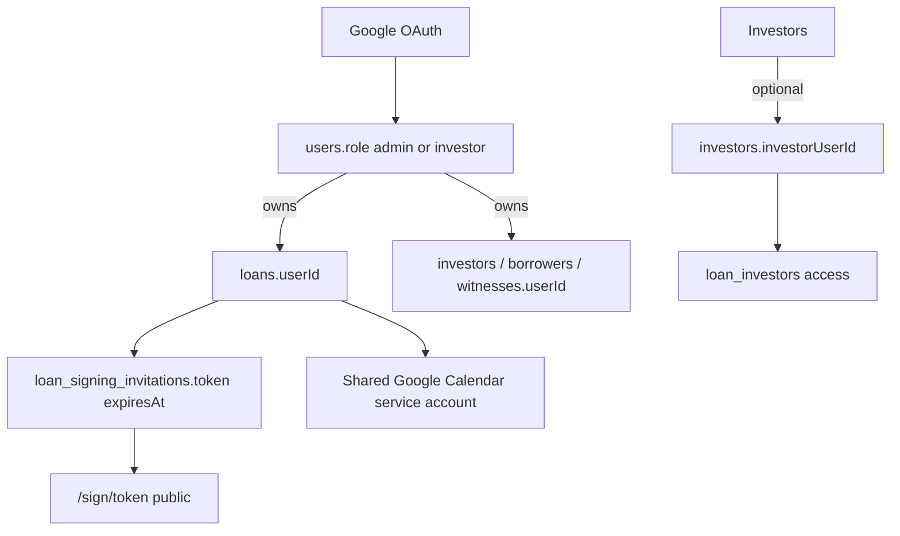
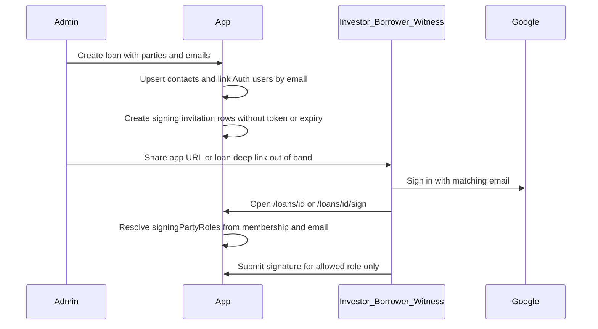

# Multi-role loan access, authenticated signing, and calendar visibility

**Status:** Done (code). Residual live QA in `docs/workflow/qa/multi-role-loan-access.md`.  
**Repo:** kame-lends (SvelteKit at `src/`)  
**Decisions locked (2026-09-09):**

| Topic               | Choice                                                                                                                  |
| ------------------- | ----------------------------------------------------------------------------------------------------------------------- |
| Edit rights         | **D** — Admin has full edit. Investors may edit only their own allocation/payments. Borrower and witness are read-only. |
| Sign-in for parties | **A** — Google OAuth only. Session email must match the party email on the loan.                                        |
| Calendar visibility | **A** — In-app loan calendar for every participant. Shared Google Calendar sync stays admin-workspace only.             |

## Problem

Today the app is effectively admin-centric:

- `user.role` is `admin | investor`, but almost no route gates on role.
- Loan access (`hasLoanAccess`) = loan owner **or** linked investor via `investors.investor_user_id`.
- Borrowers and witnesses are contact records only. No login linkage. They sign via public `/sign/[token]` with 30-day expiry.
- Nav is identical for every signed-in user.
- Mutation APIs that use `hasLoanAccess` treat investors like owners (full PUT/DELETE/status/payments).
- Google Calendar writes to one shared service-account calendar. Events are not visible to participants as personal calendars. In-app calendar exists but is not framed as the participant-facing surface.

Goal: every person on a loan (admin owner, investor, borrower, witness) can sign in with Google, see their loans, and see the in-app calendar for those loans. Signing requires login and auto-selects the correct signature slot. Token URLs and expiry go away.

---

## Current architecture (baseline)



Key files today:

| Area                    | Path                                                                                                                                                                                                    |
| ----------------------- | ------------------------------------------------------------------------------------------------------------------------------------------------------------------------------------------------------- |
| Schema                  | [`src/lib/server/db/schema.ts`](../../../src/lib/server/db/schema.ts)                                                                                                                                   |
| Access                  | [`src/lib/server/access-control.ts`](../../../src/lib/server/access-control.ts)                                                                                                                         |
| Cached lists            | [`src/lib/server/cached-data.ts`](../../../src/lib/server/cached-data.ts)                                                                                                                               |
| Auth                    | [`src/lib/server/auth.ts`](../../../src/lib/server/auth.ts), [`src/hooks.server.ts`](../../../src/hooks.server.ts)                                                                                      |
| Nav                     | [`src/lib/components/Nav.svelte`](../../../src/lib/components/Nav.svelte)                                                                                                                               |
| Signing                 | [`src/lib/loan-signing.ts`](../../../src/lib/loan-signing.ts), [`src/routes/sign/[token]/`](../../../src/routes/sign/[token]/), [`src/routes/api/sign/[token]/`](../../../src/routes/api/sign/[token]/) |
| Calendar                | [`src/lib/server/google-calendar.ts`](../../../src/lib/server/google-calendar.ts), [`src/routes/api/loans/sync-calendar/+server.ts`](../../../src/routes/api/loans/sync-calendar/+server.ts)            |
| Investor link-on-create | [`src/routes/api/investors/+server.ts`](../../../src/routes/api/investors/+server.ts)                                                                                                                   |

---

## Target access model

### Membership kinds (computed per user × loan)

A signed-in user can hold one or more memberships on a loan:

| Membership                  | How linked                                                     | View loan | Edit loan shell (name, borrower, status, contract, delete) | Edit own allocation / own payments | Sign contract slot                           |
| --------------------------- | -------------------------------------------------------------- | --------- | ---------------------------------------------------------- | ---------------------------------- | -------------------------------------------- |
| **Owner (admin workspace)** | `loans.userId = session.user.id`                               | Yes       | Full                                                       | Full (all investors)               | Only if also a lender party on that contract |
| **Investor**                | `investors.investorUserId` + `loan_investors`                  | Yes       | No                                                         | Yes (own `investorId` rows only)   | Lender slot for that investor                |
| **Borrower**                | `borrowers.borrowerUserId` + `loans.borrowerId`                | Yes       | No                                                         | No                                 | Borrower slot                                |
| **Witness**                 | `witnesses.witnessUserId` + invitation/`witnessId` on contract | Yes       | No                                                         | No                                 | Matching `witness_1` / `witness_2` slot      |

A single Google account may be investor on loan A, borrower on loan B, and witness on loan C. Access is **membership-based**, not a single global role for every screen.

### Global `users.role` (session default)

Extend enum: `admin | investor | borrower | witness`.

Rules when linking contacts:

1. Creating/updating an **investor** with email → find-or-create `users` row; set `investorUserId`; if new user (or currently non-admin), prefer `role = 'investor'` unless they already have a stronger workspace admin role.
2. Creating/updating a **borrower** with email → find-or-create user; set `borrowerUserId`; default `role = 'borrower'` when new.
3. Creating/updating a **witness** with email → find-or-create user; set `witnessUserId`; default `role = 'witness'` when new.
4. Never demote an existing `admin` when linking them as a party on someone else's loan.
5. If one person is both investor and borrower across the workspace, keep `role` as the **primary nav hint** (prefer `investor` over `borrower` over `witness`), but always compute menus from actual memberships.

`admin` remains the workspace operator who owns contacts and creates loans (`*.userId`).

### Permission helpers (replace coarse `hasLoanAccess` for writes)

Add in [`src/lib/server/access-control.ts`](../../../src/lib/server/access-control.ts):

```ts
type LoanMembership = 'owner' | 'investor' | 'borrower' | 'witness';

resolveLoanMemberships(loanId, userId): Promise<LoanMembership[]>
hasLoanViewAccess(loanId, userId): Promise<boolean>        // any membership
hasLoanAdminAccess(loanId, userId): Promise<boolean>       // owner only
hasInvestorAllocationAccess(loanId, userId, investorId): Promise<boolean>
getLoanAccessContext(loanId, userId): Promise<{
  memberships: LoanMembership[];
  canView: boolean;
  canAdminEdit: boolean;
  editableInvestorIds: number[];
  signingPartyRoles: SigningPartyRole[];
}>
```

Migrate call sites:

| Operation                                                                                                                         | Required check                                                              |
| --------------------------------------------------------------------------------------------------------------------------------- | --------------------------------------------------------------------------- |
| GET loan / list inclusion / in-app calendar events for loan                                                                       | `hasLoanViewAccess`                                                         |
| PUT loan shell, DELETE loan, status, contract customization, signing admin panel, extend interest for any investor, cleanup tools | `hasLoanAdminAccess`                                                        |
| POST/PATCH/DELETE received payments, pay-transaction, period edits                                                                | `hasLoanAdminAccess` **or** `hasInvestorAllocationAccess` for that investor |
| Contract sign submit                                                                                                              | session + email match + party role for that loan                            |
| Google Calendar bulk sync / cleanup                                                                                               | session user is admin owner of those loans (`loans.userId`)                 |

Keep Vitest coverage in `access-control.test.ts` for owner / investor / borrower / witness / outsider.

---

## Schema changes

New migration (do **not** edit shipped migrations):

1. Expand `user_role` enum: add `borrower`, `witness`.
2. `borrowers.borrower_user_id` → `users.id` (nullable, `onDelete: set null`), index.
3. `witnesses.witness_user_id` → `users.id` (nullable, `onDelete: set null`), index.
4. Signing invitations:
   - Make `token` nullable (or stop generating new tokens; keep column for legacy rows).
   - Make `expires_at` nullable; stop setting it for new invitations.
   - Prefer uniqueness on `(loan_id, party_role, investor_id)` for active invitation rows instead of relying on token.
5. Optional: `loan_signing_invitations.user_id` denormalized link for faster lookup by session (nice-to-have; email match is enough for v1).

Backfill:

- For existing investors with email + `investor_user_id`, no change.
- For borrowers/witnesses with email, find-or-create users and set `*_user_id` (one-shot SQL or server script run against **dev** branch only until unlocked for prod).

Email uniqueness: Auth.js `users.email` is unique. Party contacts may share emails across admin workspaces; linking must reuse the same Auth user when emails match (same pattern as investors today).

---

## Data scoping (lists and dashboard)

Update [`cached-data.ts`](../../../src/lib/server/cached-data.ts), [`dashboard-data.ts`](../../../src/lib/server/dashboard-data.ts), and list `+page.server.ts` loaders:

| Query       | Include loans where                                                          |
| ----------- | ---------------------------------------------------------------------------- |
| Admin owned | `loans.userId = userId`                                                      |
| Investments | linked via `investorUserId` + `loan_investors`                               |
| Borrowed    | `borrowers.borrowerUserId = userId` and `loans.borrowerId = borrowers.id`    |
| Witnessed   | invitation/`witnessId` with `witnesses.witnessUserId = userId` for that loan |

Dashboard cards and activity should respect the same unions, and should not leak other investors’ payment details to a borrower/witness beyond what the contract/loan summary already shows. Default for borrower/witness detail views: loan summary, schedule dates, status, contract/signing status. Hide admin-only tools and other investors’ internal notes if those are admin-private today.

Investor detail of **own** allocation: full payment/interest visibility for their rows only. Other co-investors: show names/amounts only if current product already exposes them on the shared loan view; do not expand PII beyond current admin loan detail without an explicit follow-up.

---

## Navigation and menus

[`Nav.svelte`](../../../src/lib/components/Nav.svelte) builds one static list today. Change to membership-aware items from layout load data.

### Proposed nav by primary memberships

| Item               | Who sees it                                       | Route                                               |
| ------------------ | ------------------------------------------------- | --------------------------------------------------- |
| Dashboard          | Everyone signed in                                | `/dashboard` (scoped widgets)                       |
| Loans              | Admin owner (workspace loans)                     | `/loans`                                            |
| Investments        | Users with ≥1 investor membership                 | `/investments` (new; or `/loans?scope=investments`) |
| Borrowed           | Users with ≥1 borrower membership                 | `/borrowed`                                         |
| Witnessed          | Users with ≥1 witness membership                  | `/witnessed`                                        |
| Transactions       | Admin only (existing feature flag)                | `/transactions`                                     |
| Borrowings (debts) | Admin only                                        | `/debts`                                            |
| Investors          | Admin only                                        | `/investors`                                        |
| Settings           | Admin: full tools. Parties: account/sign-out only | `/settings`                                         |

**Concrete route choice for this plan:** dedicated list routes `/investments`, `/borrowed`, `/witnessed` that reuse the loans list/table components with a `scope` prop and server-side filtered datasets. Avoid stuffing three audiences into one `/loans` page with fragile client filters.

Hybrid users (e.g. admin who is also an investor elsewhere) see the **union** of applicable items.

Pass into Nav from `+layout.server.ts`:

```ts
navCapabilities: {
	isAdminWorkspace: boolean; // owns any contacts/loans OR role === 'admin'
	hasInvestments: boolean;
	hasBorrowed: boolean;
	hasWitnessed: boolean;
}
```

---

## Loan detail UI (read vs edit)

Thread `access` from `loans/[id]/+page.server.ts` into `LoanDetailClient` / `LoanDetailContent`:

- **Owner:** current full UI (edit, delete, signing admin panel, sync tools).
- **Investor:** read-only loan shell; enable payment/period actions only on **their** investor cards (`editableInvestorIds`).
- **Borrower / witness:** read-only; show contract status and a **Sign** CTA if their slot is unsigned; hide Edit/Delete/admin signing link panel/copy-token UI.

Block deep links: `?edit=1` must no-op (or 403 redirect) unless `canAdminEdit`.

---

## Authenticated contract signing (replace token URLs)

### Target flow



### Route changes

| Old                                  | New                                                                                                               |
| ------------------------------------ | ----------------------------------------------------------------------------------------------------------------- |
| `/sign/[token]` (public)             | Remove from public allowlist. Replace with `/loans/[id]/sign` (auth required) or signing section on `/loans/[id]` |
| `GET/POST /api/sign/[token]`         | `GET/POST /api/loans/[id]/sign` (session required)                                                                |
| Admin “copy signing link” token URLs | Copy authenticated deep link `/loans/{id}/sign` (same URL for all parties; server picks the slot)                 |

### Server rules on sign

1. Require session (`hooks` + API 401).
2. `normalizeEmail(session.user.email)` must match the invitation `partyEmail` (or linked contact email) for a party on that loan. Reuse unused `emailsMatch()` in [`loan-signing.ts`](../../../src/lib/loan-signing.ts).
3. If multiple roles somehow match (should be rare), prefer explicit `?role=borrower|lender|witness_1|witness_2` only when the user is allowed that role; default to the single matching invitation.
4. Apply signature only to that party’s fields via existing `applySigningSignatures()`.
5. Reject if already signed (409). No expiry 410 path for new invitations.
6. Remove “Signing Link Expired” UI for new flow; legacy tokens can 410 once or redirect to login + loan sign page.

### Admin UI

- [`LoanSigningLinksPanel.svelte`](../../../src/lib/components/loans/LoanSigningLinksPanel.svelte): show party name, email, signed/unsigned; copy `/loans/{id}/sign` instead of token URL; drop expiry column.
- Stop generating tokens in [`loan-contract-persistence.ts`](../../../src/lib/server/loan-contract-persistence.ts) / [`loan-signing-server.ts`](../../../src/lib/server/loan-signing-server.ts).

### Hooks

In [`hooks.server.ts`](../../../src/hooks.server.ts): remove `pathname.startsWith('/sign/')` from public routes (or keep temporary redirect from `/sign/[token]` → login with `callbackUrl=/loans/{id}/sign` while resolving token server-side for migration).

### E2E

Update Playwright coverage that currently only opens `/sign/[token]`: sign in as the borrower Google test user (or e2e session helper), open `/loans/{id}/sign`, submit signature.

---

## Google Calendar + in-app calendar

### Verify shared Google sync still works (admin)

Audit and fix as needed:

| Path                                                                  | Expected                                                                                                                      |
| --------------------------------------------------------------------- | ----------------------------------------------------------------------------------------------------------------------------- |
| `createCalendarEvent` / `updateCalendarEvent` / `deleteCalendarEvent` | Service account credentials + `GOOGLE_CALENDAR_ID`                                                                            |
| `GET /api/loans/sync-calendar`                                        | Owner’s loans only; regenerate events; persist `loans.googleCalendarEventIds`                                                 |
| `POST /api/loans/sync-calendar`                                       | Per-loan sync/remove; **admin owner only** after permission split (investors should not mutate the shared workspace calendar) |
| `POST /api/loans/cleanup-calendar`                                    | Admin only; document that it clears the **shared** calendar                                                                   |
| Settings / Loans `SyncCalendarButton`                                 | Visible to admin workspace users only                                                                                         |

Manual QA on **dev/test calendar** (never prod calendar): create loan → sync → confirm sent/due/interest events → update due date → sync → confirm update → delete/remove → confirm delete.

Known gaps to address during implementation:

- Skill mentions attendees; code does not add them (by design for choice **3A**). Update skill/docs to match.
- `updateDailySummaryEvents` unused by routes; either wire incremental updates or leave documented as unused.
- Per-loan POST sync unused by UI; either wire from loan detail for admins or leave bulk-only.

**Out of scope:** Domain-Wide Delegation, personal Google Calendar OAuth per user, inviting attendees.

### In-app calendar for all participants (choice 3A)

- Ensure loans list/detail calendar views (`LoanCalendarView`, `buildLoanCalendarEvents` / `use-loan-calendar-events`) load for any `hasLoanViewAccess` loan set.
- Add calendar entry points on `/investments`, `/borrowed`, `/witnessed` (reuse component; events scoped to that list).
- Dashboard may show upcoming events for the user’s membership union.
- Event deep links must open routes the user can view (not admin-only URLs).

Participants “see their loan calendar event” = in-app events for disbursement, due, interest due derived from loan data they can already view. Google sync remains an admin ops tool.

---

## API and server enforcement checklist

Harden every mutating loan-related route (today many only check `hasLoanAccess`):

- [`api/loans/+server.ts`](../../../src/routes/api/loans/+server.ts) — create: admin/workspace only
- [`api/loans/[id]/+server.ts`](../../../src/routes/api/loans/[id]/+server.ts) — GET view; PUT/DELETE admin
- [`api/loans/[id]/status`](../../../src/routes/api/loans/[id]/status/+server.ts) — admin
- [`api/loans/[id]/payments`](../../../src/routes/api/loans/[id]/payments/+server.ts), `received-payments`, `extend-interest`, `pay-transaction` — admin or owning investor allocation
- [`api/loans/[id]/signing`](../../../src/routes/api/loans/[id]/signing/+server.ts) — admin manage; replace token issuance
- New [`api/loans/[id]/sign`](../../../src/routes/api/loans/) — authenticated party sign
- [`api/borrowers`](../../../src/routes/api/borrowers/), [`api/witnesses`](../../../src/routes/api/witnesses/) — mirror investor find-or-create + `*_user_id` linking; require email when the contact should get portal access
- Settings backup/sync/fix tools — admin only (not bare session)

Page loads: `/investors/[id]`, `/borrowers/[id]` stay owner-scoped for CRM. Parties use loan-centric routes, not the admin CRM pages.

---

## Implementation phases

### Phase 0 — Plan and docs (this document)

- [x] Lock decisions D / A / A
- [x] Index under `docs/workflow/planned/README.md`
- [x] Note in `docs/PROJECT.md` Auth section (link to tracker)

### Phase 1 — Schema + access core

1. Migration for roles + `borrower_user_id` + `witness_user_id` + signing token/expiry nullability.
2. Implement `resolveLoanMemberships` / `getLoanAccessContext` + tests.
3. Wire borrower/witness APIs to link Auth users by email (copy investor pattern).
4. Expand `getCachedLoans` (or split scoped loaders) for four membership unions.

### Phase 2 — Nav + list routes + read-only UI

1. [x] Layout capabilities + role-aware `Nav.svelte`.
2. [x] Add `/investments`, `/borrowed`, `/witnessed` list pages.
3. [x] Pass access context into loan detail; hide edit/delete for non-owners; investor partial edit on own cards.
4. [x] Restrict settings tools to admin.
5. [x] Route guides for new pages + sign.

### Phase 3 — Authenticated signing

1. [x] New `/loans/[id]/sign` (+ API) with email/role detection.
2. [x] Stop token generation; update admin signing panel.
3. [x] Migrate/redirect legacy `/sign/[token]`.
4. [x] Update E2E Playwright for authenticated signing.

### Phase 4 — Calendar verify + participant in-app calendar

1. [ ] Dev-calendar QA for create/update/delete sync (manual on test calendar). Blocked 2026-09-09: Google SA `invalid_grant: account not found`. See `docs/workflow/qa/multi-role-loan-access.md`.
2. [x] Restrict Google sync UI/API to admin owners.
3. [x] Expose in-app calendar on participant list routes.
4. [x] Align skill + PROJECT.md.

### Phase 5 — Hardening

1. [x] Full mutation API audit against the permission table (membership helpers on loan mutators).
2. [x] Playwright specs updated for authenticated signing (live multi-account run still manual).
3. [x] Manual QA checklist in `docs/workflow/qa/multi-role-loan-access.md`.

---

## Explicit non-goals

- Email magic-link / OTP providers (decision **2A**).
- Personal Google Calendar OAuth or Domain-Wide Delegation attendees (decision **3A**).
- Letting investors edit loan shell, borrower, co-investor rows, or delete the loan.
- Letting borrowers/witnesses mutate payments or status.
- Production Neon/Vercel deploy (still requires **`lendwave`**).

---

## Risks and mitigations

| Risk                                                          | Mitigation                                                                                        |
| ------------------------------------------------------------- | ------------------------------------------------------------------------------------------------- |
| Same email used as investor and borrower on one loan          | Allow both memberships; signing UI lists allowed roles; payment edit only for investor membership |
| Admin demoted when added as witness elsewhere                 | Never overwrite `role = admin` on link                                                            |
| Investors currently able to PUT full loan via `hasLoanAccess` | Phase 1–2 must land server checks before advertising portal as safe                               |
| Legacy token links in old emails                              | Temporary resolver redirect to authenticated `/loans/[id]/sign`                                   |
| Shared Google cleanup deletes whole calendar                  | Keep admin-only; document; prefer per-loan remove when possible                                   |
| Borrower without email cannot sign in                         | Require email on borrower/witness when enabling portal/signing; block sign CTA if missing         |

---

## Docs to update when implementing (same change)

| Doc                                                             | Update                                                                                |
| --------------------------------------------------------------- | ------------------------------------------------------------------------------------- |
| [`docs/PROJECT.md`](../../PROJECT.md)                           | Auth & roles, signing routes, calendar model                                          |
| [`docs/guides/routes/`](../../guides/routes/)                   | dashboard, loans, investments, borrowed, witnessed, sign                              |
| [`docs/guides/routes/README.md`](../../guides/routes/README.md) | Index new routes                                                                      |
| This plan                                                       | Move to `docs/workflow/in-progress/` when execution starts, then `done/` when shipped |
| `.agent/skills/loan-domain/SKILL.md`                            | Portal + membership model                                                             |
| `.agent/skills/google-calendar-integration/SKILL.md`            | Admin shared calendar + in-app for parties                                            |
| `.agent/skills/auth-js-sveltekit/SKILL.md`                      | Roles + party linking                                                                 |

---

## Success criteria

1. Admin creates a loan with investor, borrower, and witness emails → each can Google-sign-in and open that loan.
2. Borrower and witness cannot edit or pay; investor can record payments only on their allocation; admin retains full control.
3. Nav shows Investments / Borrowed / Witnessed according to memberships.
4. Signing requires Google login; correct signature field is selected from loan party role; no token URL or expiry in the happy path.
5. In-app calendar shows that loan’s events for all four memberships; admin Google sync create/update/delete verified on a test calendar.


## Residual verification

Tracked in [`docs/workflow/qa/multi-role-loan-access.md`](../qa/multi-role-loan-access.md):

1. Replace Google service account credentials (current SA returns `invalid_grant: account not found`), then run calendar create/update/delete smoke on the test calendar.
2. Manual multi-user Google sign-in for investor, borrower, and witness on one loan.
